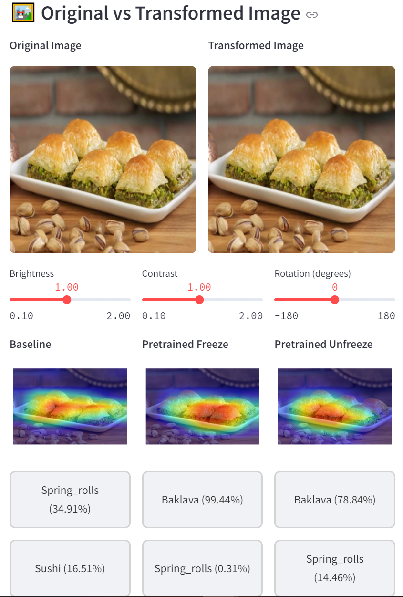
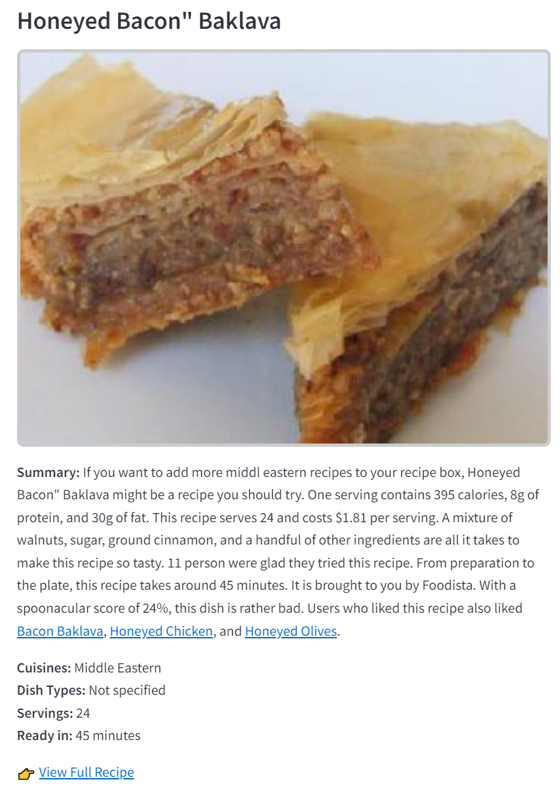

# 🍽️ Food-101 Web App 

An interactive Streamlit application for visualizing **Food-101** image classification models with Grad-CAM explanations and recipe recommendations.
[Check the Live Web App](https://food-101-web-dl.streamlit.app/)


## Features

- Three model comparisons: Baseline, Pretrained Freeze, Pretrained Unfreeze
- Image transformation sliders (brightness, contrast, rotation)
- Grad-CAM visualizations for model interpretability
- Recipe recommendations based on predictions
- Fast and clean UI, optimized for performance

## Image


<br>



## Installation

```bash
git clone https://github.com/akw-waked/Food-101-Web
cd food101-web
python -m venv venv
source venv/bin/activate  # On Windows: venv\Scripts\activate
pip install -r requirements.txt
streamlit run app.py
